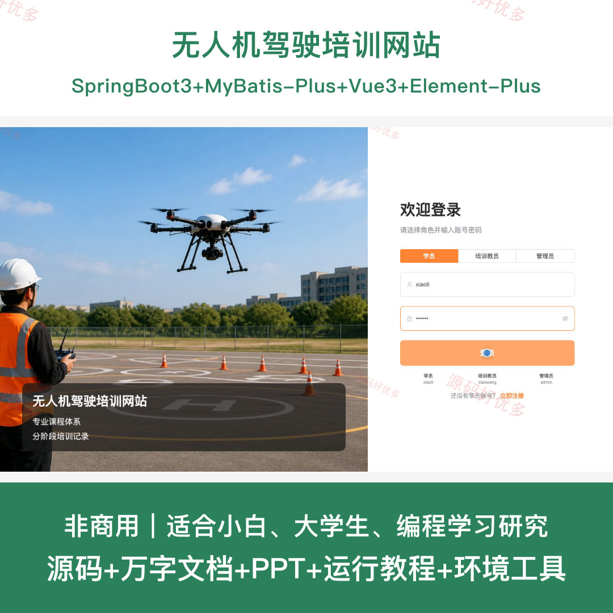
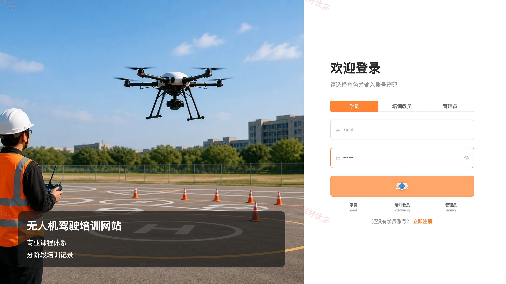
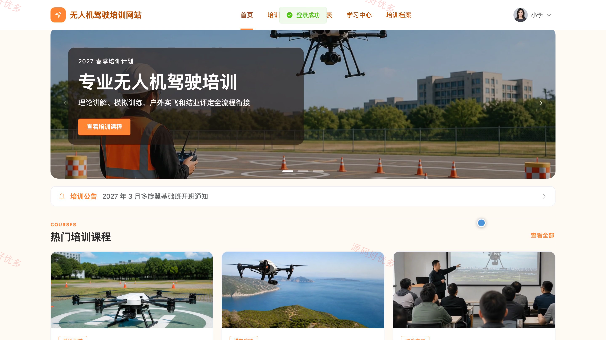
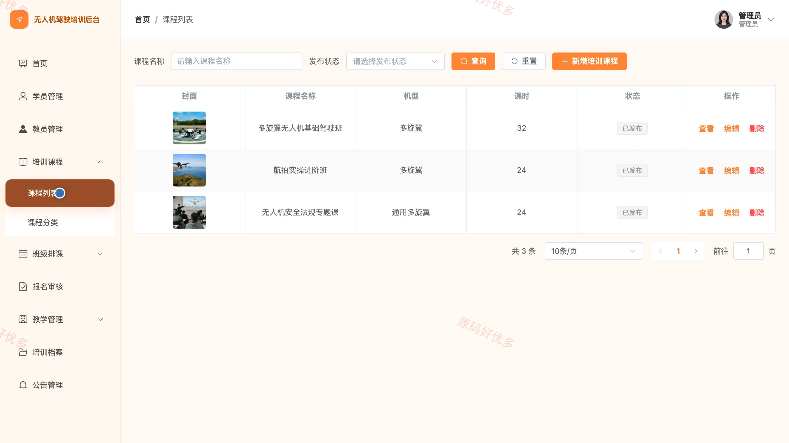

## 源码问题查看主页咨询

### 一、关键词
无人机驾驶培训、无人机培训报名、飞行课程学习、无人机理论练习、实飞训练管理

### 二、作品包含
源码+数据库+万字设计文档+PPT+全套环境和工具资源+本地部署教程

### 三、项目技术
前端技术： Html、Css、Js、Vue3.4、Element-Plus
后端技术：Java、SpringBoot3.2.0、MyBatis-Plus

### 四、运行环境（以下版本亲测，其他版本兼容性请自行测试）
开发工具：IDEA/eclipse + VSCODE

数据库：MySQL5.7+（共14张表）

数据库管理工具：Navicat10以上版本

环境配置软件： JDK17 + Maven

前端Nodejs：16+

浏览器：谷歌浏览器

### 五、项目介绍
项目编号：bs084A

无人机驾驶培训网站面向学员、培训教员和管理员，围绕无人机课程报名、班级排课、学习资料、理论练习、实飞训练记录与结业档案提供贯穿培训全过程的信息服务。

角色：学员、培训教员、管理员

学员功能：培训课程浏览与报名、报名审核进度查询、个人培训课表查看、学习资料查看、无人机理论题库练习、培训档案与结业进度查看、个人资料与密码维护。

培训教员功能：培训数据概览、培训班级与课表管理、学员报名审核、学习资料管理、实飞训练记录管理、理论考核管理、培训档案与结业评定、个人资料维护。

管理员功能：培训数据概览、学员与培训教员管理、培训课程与分类管理、培训班级与课表管理、学员报名审核、学习资料及训练考核管理、培训档案与结业管理、培训公告管理。

### 六、运行截图

